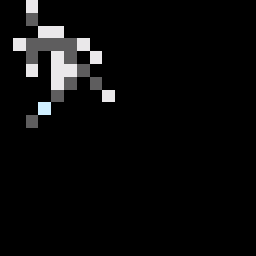
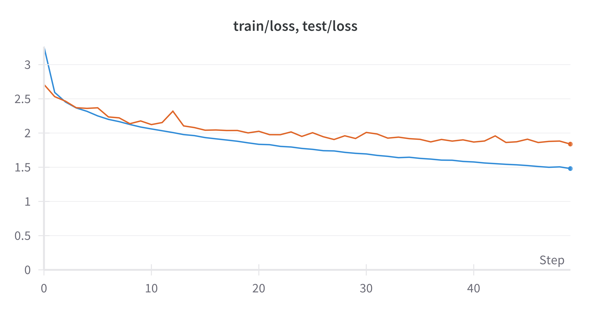
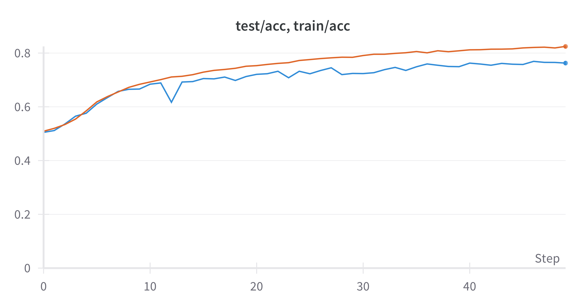
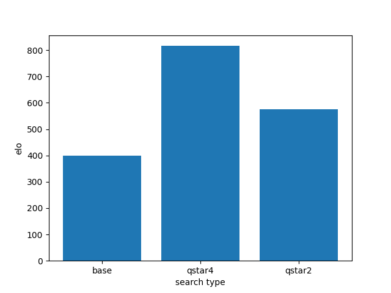

# Is it Q*?

There are many rumours about Q* algorithm. 
One thing we can suppose to about this algorithm is naming. 
This project is about implementing the Gomuku, easier than Go, with various traditional path finding algorithms for best decision making based on game theory.


## Playing Game Guide

1. First, Clone this repository.

```
git clone https://github.com/yoonhero/betago
```

2. And install requirements.

```
pip install -r requirements.txt
```

3. Finally, play against ai.

```
GUI=True BOT=qstar MAX_VERTEX=3 MAX_DEPTH=5 ./main.py
```


## Method

I use ResNet based U-Net architecture for predicting policy distribution and value, just as alphago. But I exploit the unet's image transforming ability for predicting policy job.



> blue is GT


> prediction





### Q* Algorithm

To implement Q* algorithm in zero sum game, I pressume several things because this is unusual searching situation. A complex game such as gomuku or go has tremendous possible winning scenarios incomparable with traditional searching environment. So I simplify this situation. We cannot know every edge transition cost. Borrowing some Reinforcement learning ideas, I define the transition cost as oppositer's expected value according to their best action like minimax algorithm's oppositer. And heuristic value is 1 minus my excpted value. Except for this, everything follow the A* algorithm. It can step bigger toward winning than traditional game theory algorithm such as alpha-beta pruning. 


*Searching Process*

```
open: Priority Queue
values: Map()

1. Start From Greedy Choices.
2. Push them inside the open.

while not PQ.empty():
    item <- pop from open
    
    new_state <- (state, action)
    opposite_action = Policy Net (new_state)
    new_state <- (new_state, opposite_action)
    current_cost = opposite_expected_value = Value Net (new_state)

    current_state_cost = previous_state_cost + current_cost

    if new_state not in values keys or current_state_cost < values[new_state]
        my_actions = Policy Net (new_state)
        
        for my_action in my_actions
            temp_state <- (new_state, my_action)
            my expected value = Value net (temp_state)
            heuristic_cost = 1 - my expected value 
            final_cost = current_state_cost + heuristic_cost
            put item on open
```

**Performance**



> Q*(n) referes to the max searching depth (n turn)

> 1 = attack-defend

This was performance result of Qstar Searching Algorithm. Both searching method starts from ELO score 400. After 100 game simulations, Qstar's real winning probability is almost 75%. It's quiet impressing that not changing model itself but just changing the searching method could improve the performance. This is prototype of Q* algorithm implementation. So you can improve more and more based on my idea.